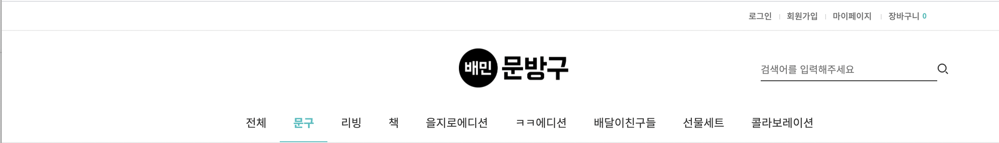
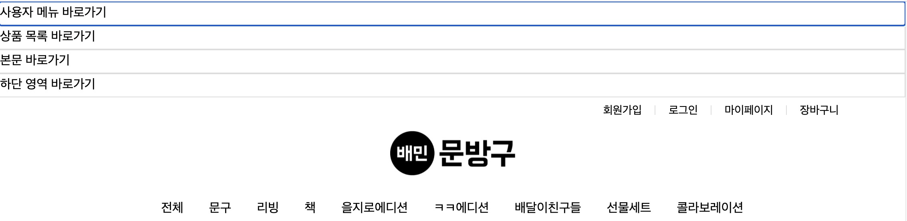
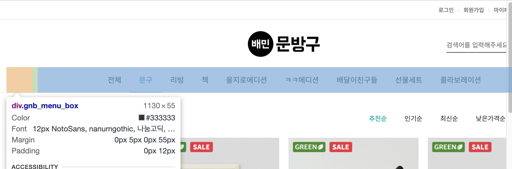
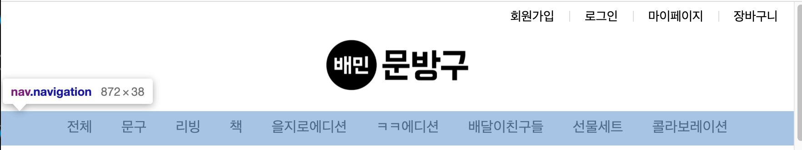
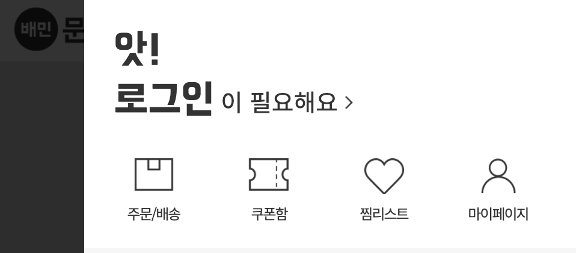
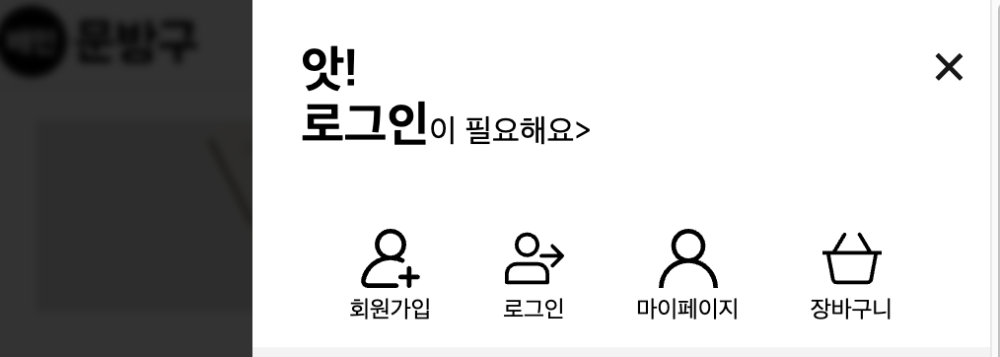
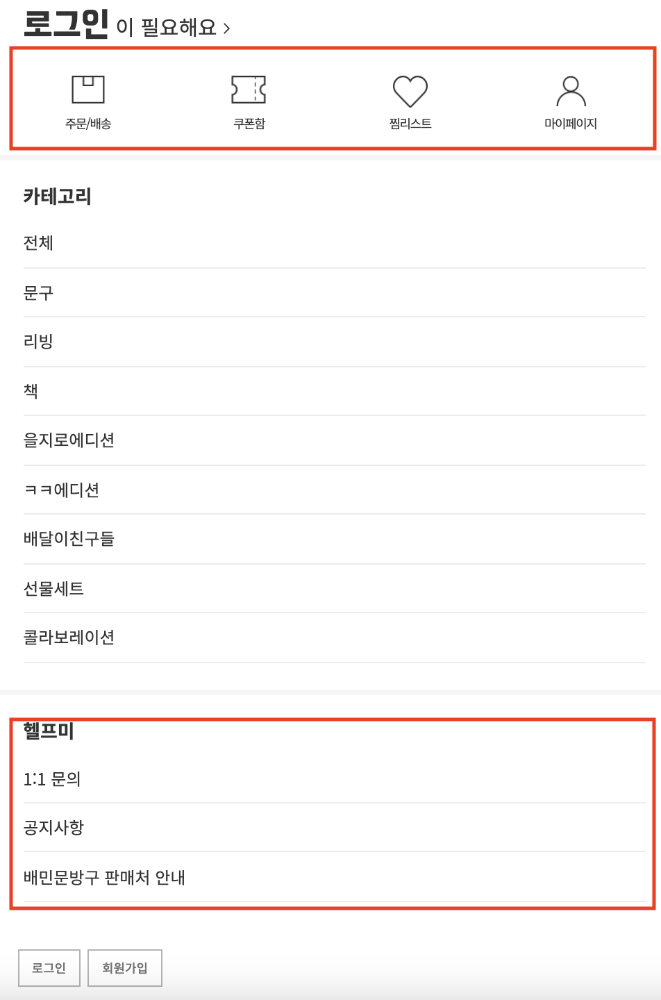
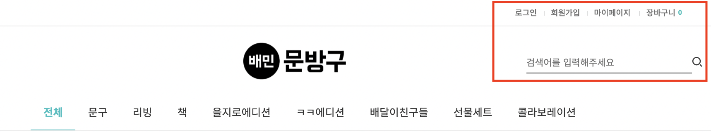
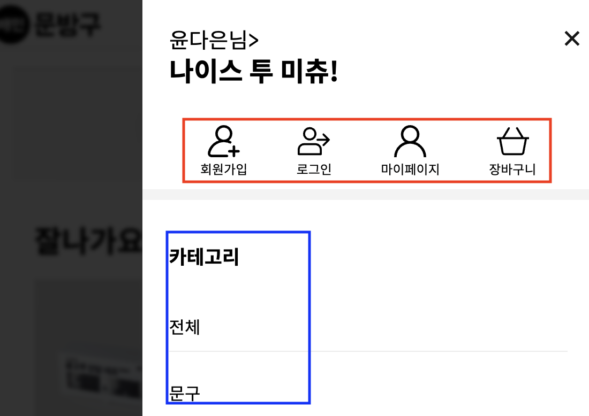
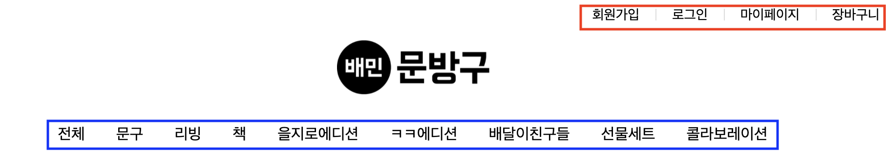

# 접근성을 고려한 배민 문방구 홈페이지

## 프로젝트 개요

적응형 홈페이지인 배민 문방구를 반응형으로 만들었습니다. 따라서 하나의 HTML 파일로 뷰포트의 크기에 따라 레이아웃이 변하는 것을 볼 수 있습니다. 또한 WCAG 2.1버전에 있는 지침들을 근거로 웹 접근성을 향상시켰습니다.

## 역할 분담

윤다은 고상원 오재원 장지훈
1. 윤다은 : 헤더 영역
2. 고상원 : 홈페이지 메인 영역
3. 장지훈 : 상품 상세 페이지 메인 영역
4. 오재원 : 로그인 페이지, 푸터 영역

## 코딩 컨벤션

Sass 사용 시 BEM 컨벤션을 사용하였습니다.

## 웹 표준 및 웹접근성 관점에서 기존 홈페이지 문제점

### HTML5 표준

|에러 내용|
|:--|
|img 태그에 필수 속성인 alt 작성x|

### WCAG
|접근성 위반 내용|관련 지침|
|:--|:--|
|a 태그 버튼 사용시 role 속성 추가 x|1.3.1 정보와의 관계|
|상품 이미지와 상품명 간의 연관성 x|1.3.1 정보와의 관계|
|상품에 마우스를 올릴 시 나타나는 아이콘(장바구니 찜)에 대한 설명x|1.3.3 감각 특성|
|main, navigation과 같은 시맨틱 태그 사용x|1.3.6 목적 확인|
|Footer의 글자와 배경간의 대조가 낮습니다.|1.4.3 Contrast(Minimum)|
|반복되는 메뉴에 대한 우회x|2.4.1 블록 우회|
|키보드 포커스 표시x|2.4.7 포커스 표시|
|페이지 언어 명시x|3.1.1 페이지의 언어|
|영역에 대한 헤더x|3.1.1 제목과 레이블|
|버튼에 대한 설명 x|4.1.2 이름,역할,값|

### HTML 검사 결과

## 수정 계획

|헤더|홈페이지 메인|상품 상세 페이지 메인|로그인|푸터|
|:--:|:--:|:--:|:--:|:--:|
|nav, ul 태그를 이용하여 버튼 마크업|예시|예시|예시|예시|
|메뉴 닫기 버튼 추가|예시|예시|예시|예시|
|논리적 순서에 따른 마크업 통일|예시|예시|예시|예시|
|스킵 네비게이션 추가|예시|예시|예시|예시|

## 결과

### 헤더

#### 스킵 네비게이션

수정 전

수정 후

스킵 네비게이션을 통해 반복되는 메뉴에 대한 우회를 막습니다.

#### 시맨틱 마크업

수정 전

수정 후

시맨틱 태그를 활용하였기 때문에 의미 전달이 명확합니다.

#### 모달창

수정 전

수정 후

키보드로도 모달 창을 끌 수 있도록 하였으며, 콘텐츠 집중을 위해 뒤쪽을 흐리게 보이도록 하였습니다.

#### 키보드 포커스 표시

수정 후

기존 배민 문방구에선 탭에 따른 아웃라인이 보이지 않습니다. 이를 수정하여 사용자의 포커스를 아웃라인으로 나타냅니다.

#### 마크업 통일성

수정 전

모바일

데스크탑

헬프미같은 경우 푸터에 있음에도 불구하고, 모바일 화면에서 중복해서 보여줍니다. 또한 로그인, 회원가입과 마이페이지가 떨어져있어 통일성이 떨어집니다.

수정 후

모바일

데스크탑 

모바일과 데스크탑 모두 사용자 메뉴가 먼저오고 그 다음에 상품 목록이 등장합니다.

### 홈페이지 메인

### 상품 상세 페이지 메인

### 로그인

### 푸터

### 문법 검사 결과

### 접근성 검토

### 라이트 하우스 분석 결과

## 프로젝트 후기

윤다은 : 적응형이었던 웹을 반응형으로 줄이면서 두 레이아웃에 통일감을 주기 위한 고민이 즐거웠습니다. 시맨틱 마크업만 해도 접근성이 크게 올라갈 수 있음을 알았고, 다양한 상태에 따른 레이아웃 변화를 고려할 수 있었습니다. 더해서 자바스크립트와 레이아웃을 잘 몰랐는데 상의해주면서 도와준 팀원들에게 고맙다고 말하고 싶습니다.

## 참고 사이트

[WCAG](https://www.w3.org/TR/WCAG21/)
[배민 문방구](https://store.baemin.com)

