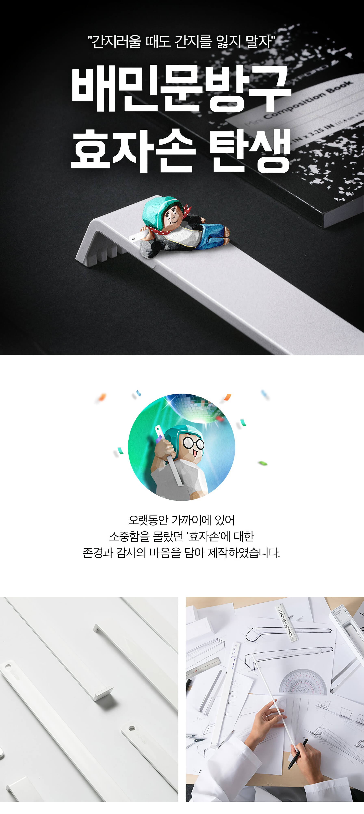
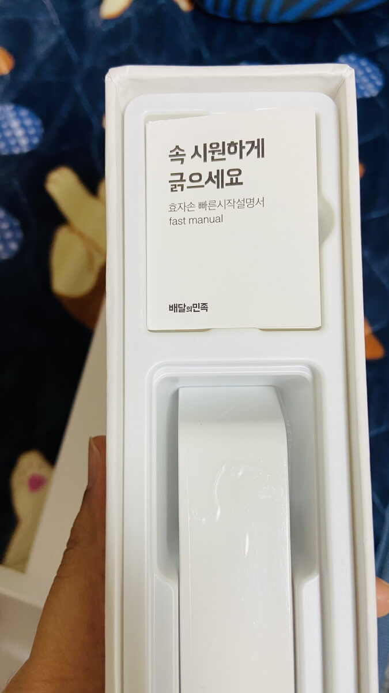

### 상품 상세 페이지 메인

#### WCAG
|접근성 위반 내용|관련 지침|
|:--|:--|
|a 태그 버튼 사용시 role 속성 추가 x|1.3.1 정보와의 관계|
|상품 이미지와 상품명 간의 연관성 x|1.3.1 정보와의 관계|
|상품에 마우스를 올릴 시 나타나는 아이콘(장바구니 찜)에 대한 설명x|1.3.3 감각 특성|
|main, navigation과 같은 시맨틱 태그 사용x|1.3.6 목적 확인|
|Footer의 글자와 배경간의 대조가 낮습니다.|1.4.3 Contrast(Minimum)|
|반복되는 메뉴에 대한 우회x|2.4.1 블록 우회|
|키보드 포커스 표시x|2.4.7 포커스 표시|
|페이지 언어 명시x|3.1.1 페이지의 언어|
|영역에 대한 헤더x|3.1.1 제목과 레이블|
|사용자 입력이 필요할 컨텐츠에 레이블 또는 지침x|3.3.2 레이블 또는 지침|
|버튼에 대한 설명 x|4.1.2 이름,역할,값|

#### 수정 계획

|상품 상세 페이지 메인| 관련 지침 |
|:--:|:---:|
|`<html>` lang 속성 추가| 3.1.1 페이지의 언어
|`` alt 속성 추가|웹 표준
|**상품 평점 표시 개선**|1.3.3 감각적인 특성
|**탭 메뉴 개선**|	4.1.2 이름,역할,값
|**이미지 해상도 개선**|웹 표준
|**상품필수 정보 마크업 개션**|1.3.1 정보와 관계
|시맨틱 태그를 사용하여 마크업|1.3.6 목적 확인
|**상품후기 개선**|1.3.1 정보와 관계

#### `<html>` 태그에 lang 속성 추가
- 웹 페이지의 기본 언어를 설정해주지 않으면 사용자 에이전트가 언어 콘텐츠를 올바르게 표시하지 못하여 렌더링이 제대로 이루어지지 않을 수 있습니다. 또한 스크린 리더가 올바른 발음 규칙을 불러오지 못할 수 있습니다.
- **수정 전**
  ```html
  <html></html>
  ```
- **수정 후**
  ```html
  <html lang="ko-KR"></html>
  ```

#### `` 태그에 alt 속성 추가
- `` 태그의 필수 속성인 alt가 누락되어 있습니다. 해당 속성이 누락되어 있으면 스크린 리더 등 보조기기 사용자들은 이미지를 이해할 수 없으며, 검색엔진 최적화에도 좋지 않습니다. 그래서 명확하지 않은 이미지의 경우, alt 속성 추가 후 빈값으로 나뒀으며, 명확한 이미지의 경우에는 alt 속성과 값을 추가해줬습니다.
- 상세 설명의 마지막 이미지의 경우 `<fiqure>` 속성을 사용한 후 전체 이미지에 대한 설명을 추가했습니다.
- **수정 전**
  
- **수정 후**
  ```html
  
  <figure>
    
    <figcaption class="a11yHidden">배민문방구 효자손은 마음을 담아 제작하였습니다. 효자손이 재탄생하였습니다.</figcaption>
  </figure>
  ```

#### 상품 평점 표시 개선
- 기존 상품후기의 만족도는 별 이미지로 표현되어 있었습니다. 데스크탑의 경우에는 단순히 `별`이라는 문구로만 나타나 있었고, 모바일의 경우에도 `별점 5`와 같이 단순하게 표시되어 스크린 리더 사용자가 제대로 인식할 수 없는 문제가 있었습니다. 또한 `<div> 또는 <span>`으로 묶어져 있어 해당 내용이 만족도인지 인지할 수 없는 문제도 있었습니다.
- 기존 별 이미지를 활용하여 만족도를 나타내는 방식이 아닌 `"매우 만족", "만족", "보통", "불만족", "매우 불만족"`의 다섯 단계로 변경하였습니다.
- 만족도임을 정확히 나타내기 위해 `<dl>, <dt>, <dd>`를 활용하였습니다.
- **수정 전**
  ```html
  <!-- 데스크탑 -->
  <span class="rating_star">
    <span style="width:100%;">별</span>
  </span>

  <!-- 모바일 -->
  <div class="star_box">
    <span class="star_li" style="width:80%">별점 4</span>
  </div>
  ```
- **수정 후**
  ```html
  <dl class="goods__review-info">
    <dt class="goods__review-info-key">만족도</dt>
    <dd class="goods__review-info-score">매우 만족</dd>
  </dl>
  ```

#### 탭 메뉴 개선
- 기존 탭 메뉴의 경우 단순히 `<ul>, <li>, <a>` 태그로 구성되어 있어 스크린 리더 등 보조기기를 사용하는 사용자들은 정보에 접근하기 어려웠습니다.
- WAI-ARIA의 `role` 속성의 값 중 `tablist, tab, tabpanel`을 활용하여 탭 메뉴를 재구성해 보조기기를 사용하는 사용자에게 보다 정확한 정보를 제공받을 수 있도록 하였습니다.
- **수정 전**
  ```html
  <div id="detail">
    <div class="item_goods_tab">
        <ul>
            <li class="on"><a href="#detail">상품상세정보</a></li>
            <li><a href="#delivery">배송안내</a></li>
            <li><a href="#exchange">교환 및 반품안내</a></li>
            <li><a href="#reviews">상품후기 <strong>133</strong></a></li>
            <li><a href="#qna">상품문의 <strong>6</strong></a></li>
        </ul>
    </div>
  </div>
  ```
- **수정 후**
  ```html
    <ul class="tab-list" role="tablist" aria-label="상품 정보, 후기, 문의 탭 메뉴">
      <li role="none">
        <a href="#detailInfo" role="tab" aria-selected="true" aria-controls="detailInfo" id="tab1">상세정보</a>
      </li>
      <li role="none">
        <a href="#basicInfo" role="tab" aria-selected="false" aria-controls="basicInfo" id="tab2">기본정보</a>
      </li>
      <li role="none">
        <a href="#review" role="tab" aria-selected="false" aria-controls="review" id="tab3">상품후기</a>
      </li>
      <li role="none">
        <a href="#question" role="tab" aria-selected="false" aria-controls="question" id="tab4">상품문의</a>
      </li>
    </ul>
    <section id="detailInfo" class="goods__detail-info" role="tabpanel">...</section>
  ```

#### 이미지 해상도 개선
- lighthouse를 활용해 배민 문방구 웹사이트를 검사 시 낮은 해상도의 이미지를 제공한다는 문제점이 발견되었습니다. 해당 문제를 해갤하기 위해 이미지 해상도 개선 사이트인 `waifu2x`와 이미지의 용량을 줄일 수 있는 `TinyPng`을 사용해 이미지를 개선했습니다.
- **수정 전**
  
- **수정 후**
  `해당 문제는 발견되지 않았습니다.`


#### 상품 필수 정보 마크업 개선
- 배민 문방구 데스크탑 페이지의 경우, 상품필수 정보 설명란이 테이블로 구성되어 있으나, `<th>` 태그에 `scope` 속성을 활용해 연관성을 지정해주지 않아 스크린 리더 등 보조기기 사용자에게 정확한 정보를 제공하지 못할 수 있습니다.
- `<dl>, <dt>, <dd>` 태그를 활용해 `Name`과 `Value`로 구분지어 주었습니다.
- **수정 전**
  ```html
  <table class="left_table_type">
    <tbody>
      <tr>
          <th style="width:20%">종류</th>
          <td colspan="3" style="width:80%">효자손</td>
      </tr>
      <tr>
          <th style="width:20%">소재</th>
          <td colspan="3" style="width:80%">플라스틱</td>
      </tr>
    </tbody>
  </table>
  ```
- **수정 후** 
  ```html
  <dl class="goods__details-list">
    <dt>종류</dt>
    <dd>효자손</dd>
    <dt>소재</dt>
    <dd>플라스틱</dd>
    <dt>치수</dt>
    <dd>26 x 425.5mm / 5mm</dd>
  </dl>
  ```

#### 시맨틱 태그를 사용하여 마크업 개선
- 모바일 페이지의 경우에는 시맨틱 태그를 잘 사용하였으나, 데스크탑 페이지는 시맨틱 태그를 사용하지 않고 `<div>`태그만을 사용하였습니다. 
- 시맨틱 태그를 사용하면 검색엔진 최적화 관점에서 중요한 키워드로 간주되 검색 랭킹에 영향을 주는 이점이 있고, 스크린 리더 등의 보조 기기를 사용하는 사용자가 페이지를 탐색할 때 푯말로 사용할 수 있는 장점이 있습니다.
- **수정 전**
  ```html
  <div class="h1_logo"></div>
  <div id="header"></div>
  <div id="footer"></div>
  ```
- **수정 후**
  ```html
  <h1 class="header__logo"></h1>
  <header class="header"></hedaer>
  <footer class="footer"></footer>
  ```

#### 상품후기 개선
- 기존 상품후기 페이지의 경우 모바일은 `<div>, <span>, <a>` 등의 태그로 구성되어 있고, 데스크탑의 경우도 `<table>`로 구성되어 있으나 `<thead>` 태그가 `displsy: none`으로 되어있어,  스크린 리더 등 보조 기기 사용자가 후기 내용이 어딘지, 작성자가 누군지 등을 정확히 파악하기 어려웠습니다.
- `<dl>, <dt>, <dd>` 태그를 활용하여 `Name`과 `Value`로 구성해 정보를 정확히 파악할 수 있게 구성하였습니다.
- **수정 전**

- **수정 후**
  ```html
  <dl class="goods__review-info">
    <dt class="goods__review-info-key">만족도</dt>
    <dd class="goods__review-info-score">매우 만족</dd>
    <dt class="goods__review-info-key">작성자</dt>
    <dd class="goods__review-info-author">손오공</dd>
    <dt class="goods__review-info-key">작성일</dt>
    <dd class="goods__review-info-date">
      <time datetime="2021-05-03">2021.05.03</time>
    </dd>
    <dt class="goods__review-info-key">작성 내용</dt>
    <dd class="goods__review-info-content">
      <details>
        <summary>ㅋㅋㅋ 원래 고급스러운 맛으로 쓰려한거니까</summary>
        
        <p>애플 디자인 패키지 같아 고급스럽고 재밌네요</p>
      </details>
    </dd>
  </dl>
  ```

#### 라이트 하우스 분석 결과

##### 데스크탑

###### 개선 전


###### 개선 후


##### 모바일

###### 개선 전


###### 개선 후


#### 프로젝트를 진행하며 느낀점
- 평소 관심이 많았던 우아한 형제들에서 만든 배민 문방구를 분석한 다음 더 좋게 만든다는게 너무 재밌는 활동이었던 것 같다. 그리고 몸이 불편하지 않은 내가 쇼핑몰을 이용할 때는 불편한지 몰랐지만, 스크린 리더 등의 보조기기를 사용하시는 분들은 많이 불편하겠다는 것을 느꼈습니다. 앞으로 나아가야 할 길은 멀지만 조금씩이라도 모두가 편안하게 이용할 수 있는 웹 페이지를 만들 것입니다.

#### 참고 자료
- [MDN ARIA:tab role](https://developer.mozilla.org/en-US/docs/Web/Accessibility/ARIA/Roles/Tab_Role)
- [MDN Figure](https://developer.mozilla.org/ko/docs/Web/HTML/Element/figure)
- [레진 WAI-ARIA 가이드라인](https://github.com/lezhin/accessibility/blob/master/aria/README.md#tab)
- [TinyPNG](https://tinypng.com/)
- [Waifu2x](https://waifu2x.booru.pics/)
- [이듬 상품 평점 영상](https://www.youtube.com/watch?v=h77tXLhMF7o)