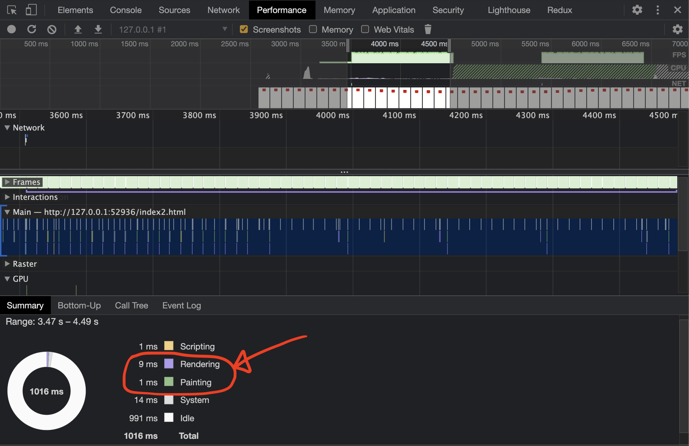

# 접근성을 고려한 배민 문방구 홈페이지
## 메인 페이지
### WCAG
|접근성 위반 내용|관련 지침|
|:--|:--|
|상품에 마우스를 올릴 시 나타나는 아이콘(장바구니 찜)에 대한 설명 x|1.3.3 감각 특성|
|main, navigation과 같은 시맨틱 태그 사용 x|1.3.6 목적 확인|
|할인율을 나타내는 글자와 배경간의 대조가 낮음|1.4.3 명암 대비|
|키보드 포커스 표시 x|2.4.7 포커스 표시|
|페이지 언어 명시 x|3.1.1 페이지의 언어|
|영역에 대한 헤더 x|3.1.1 제목과 레이블|
|버튼에 대한 설명 x|4.1.2 이름,역할,값|

### 수정 계획

|메인 페이지|
|:--:|
|`<html>` lang 속성 부여</html>|
|영역의 헤딩 추가|
|이미지 해상도 및 용량 개선|
|role을 사용한 역할 부여|
|텍스트 명도대비 개선|
시멘틱 태그를 사용하여 마크업|
아이콘 설명 추가|

### `<html>` 태그에 lang 속성 부여
- 스크린 리더가 lang 속성으로 지정되어 있는 언어를 인식하여 자동으로 음성을 변환하거나 해당 언어에 적합한 발음을 제공할 수 있도록 lang속성을 부여하였습니다.
- **수정 전**
  ```html
  <html></html>
  ```
- **수정 후**
  ```html
  <html lang="ko-KR"></html>
  ```

### 영역의 헤딩 추가
- h1 태그가 존재하지 않습니다. 이는 WCAG 3.1.1. 제목과 레이블에 위배됩니다. h1 ~ h6 태그를 전부 사용할 필요는 없지만 `h1`태그는 가장 큰 제목이고 SEO에서 중요한 역할을 하기 때문에 적용해야 합니다. 또한, 순차적으로 정보에 접근하는 시각 장애인에게 도움이 됩니다.
- **수정 전**
  - h1, h2 태그를 가지고 있지 않습니다.

    
  
- **수정 후**
  - h1~h3 태그를 사용하여 제목 요소를 마크업하였고 숨김 처리가 필요한 부분은 CSS로 숨김 처리를 하였습니다.

      

### 아이콘 부가설명 추가
- 상품에 마우스를 올리면 아이콘이 나오게 됩니다. 하지만, 모양을 인지하지 못하는 사용자를 위한 텍스트를 제공하지 않았고 이는 WCAG 1.3.3. 감각특성에 위배됩니다.

    

- **수정 전**
  - 아이콘에 대한 부가설명이 존재하지 않습니다.
    ```html
    <i class="xi-cart-o"></i>
    ```
  
- **수정 후**
  - backgroud 속성을 사용하여 아이콘 이미지를 삽입하였고 span태그로 아이콘에 대한 부가 설명을 삽입하였습니다. 결과적으로 화면에 보이지 않고 스크린 리더기로 정보를 얻을 수 있게 되었습니다.
    ```html
    <div class="cart">
      <span class="a11yHidden">장바구니</span>
    </div>
    ```


### 명확한 명도 대비
- 가격의 할인율을 명시할 때 배경 색과 4.5대 1 이하의 명도 대비를 가진 색상을 텍스트 색상으로 사용하였으며 이는 WCAG 1.4.3. 명암대비에 위배됩니다.
- 할인율의 글자색과 배경색의 명암비가 4.5:1 이하이기 때문에 시력이 낮은 사람에게 읽는데 어려움을 줄 수 있습니다. 따라서, 텍스트와 배경 사이에 최소 대비 비율을 제공하여 사람이 전체 색상 범위를 보지 않더라도 텍스트를 더 읽기 쉽게 만들 수 있습니다.

    
  
- **수정 전**
  - 2.94:1의 명도 대비를 가지고 있습니다.
  
    
  
- **수정 후**
  - 명도비 4.5 이상의 색상으로 수정하였습니다.
  
    

### 시멘틱 태그를 사용하여 마크업
- 해당 페이지는 main, navigation 등의 시맨틱 태그를 사용하지 않았으며 이는 WCAG 1.3.6. 목적 확인에 위배됩니다. 시맨틱 태그를 사용하면 시각장애인들은 웹 사이트를 이용할 때 화면 낭독기 같은 웹 보조 기구를 이용하는데 이때 어느 부분이 제목이고 내용인지 구별할 수 있게 됩니다.
- **수정 전**
  - 시맨틱 태그가 존재하지 않고 `div`태그로 구현되었습니다.

      
  
- **수정 후**
  - 시맨틱 태그를 추가하였습니다.

      


### 포커스
- 기존 페이지에서는 키보드를 사용하여 포커스를 사용할 수 없었으며 이는 WCAG 2.4.7. 식별 가능한 포커스에 위배됩니다.
- **수정 후**
  - 사용자의 포커스를 아웃라인으로 나타낼 수 있습니다.

    

## 메인 페이지 최적화
### 레이아웃 최적화(Reflow)
- 신상품에서 `hover`상태가 되면 다음과 같이 아이콘이 아래에서 위로 올라오게 되고 `hover`상태에서 벗어나면 아이콘이 다시 아래로 내려갑니다.

     

- 이때, 요소를 이동시키는 방법으로는 transform의 `translate`와 top, left 등을 사용하는 `positioning`이 존재합니다.
- 웹 페이지의 렌더링은 상황에 따라 반복하여 발생할 수 있습니다. Render 트리는 DOM 트리와 CSSOM 트리가 변경될 때 다시 재구성 됩니다. 이 과정을 레이아웃 또는 reflow라고 합니다. 레이아웃은 요소의 위치에 영향을 주는 CSS 속성값을 변경할 때 발생하고, 반대로 영향을 주지 않는 CSS 속성값을 변경하는 경우에는 페인트 즉, 리페인트 과정이 진행됩니다.
- `transform`은 다른 요소에 영향을 미치지 않고 위치를 변경할 수 있어 reflow와 repaint가 발생하지 않습니다. 그에 따라 상품에 hover시 `positioning`이 아닌 `translate`를 사용하였습니다.
- 구현한 웹 페이지에서는 매우 작은 부분을 차지하여 체감을 할 수 없어 따로 구현 후 웹 페이지 로딩 단계를 차트 형태로 볼 수 있는 크롬 개발자 도구의 Performance 패널로 확인을 해보았습니다.
- `positioning`을 사용한 경우
    

- `translate`을 사용한 경우
    

- 결과적으로, `positioning`은 `translate`와 다르게 위치가 이동하는 동안 paint가 지속적으로 일어났고 렌더링 속도도 그에 따라 늦어지게 되었습니다.

### Image Sprite
- 이미지가 많을수록 HTTP 요청이 많아지기 때문에 스프라이트 기법을 사용하여 요청 횟수를 줄일 수 있습니다.
- 하지만 스프라이트 기법은 불필요한 이미지도 모두 받아오는데다 유지보수가 까다롭기 때문에 수정사항이 거의 없는 찜 아이콘과 장바구니 아이콘에 적용시켰습니다.
- 장바구니 아이콘과 찜 아이콘을 Image Sprite Generator를 사용하여 하나의 이미지로 생성하였고 `background-position` 속성을 사용해 배경 이미지의 위치를 조정하였습니다.
- 처음에는 다음과 같이 px로 조절하려고 하였으나 유동적으로 변화하는 반응형 웹이기 때문에 다른 방법을 사용하였습니다. 
```css
.cart {
    background: url('../images/icon_sprites.png') -10px -10px no-repeat;
}
```
- 아이콘 2개를 가로 방향으로 합쳤기 때문에 background의 가로 사이즈는 200%, 세로 사이즈는 100%가 됩니다. 따라서, 각 아이콘의 `background-position`을 (0, 0), (100%, 0)으로 지정하였습니다. 
```css
.cart {
    background: url('../images/icon_sprites.png') 100% 0 no-repeat;
    background-size: 200% 100%;
}
```

- 추가적으로, 크롬 개발자 도구의 Network 패널에서 여러 개의 이미지 파일과 이미지 스프라이트를 사용하였을 때를 비교해보았습니다.
    - 여러 개의 이미지 파일
        

    - 이미지 스프라이트
        

- 결과적으로, 이미지 스프라이트를 사용했을 때 리소스 요청 수가 줄어들어 로딩 시간이 빨라집니다.

## 문법 검사 결과


## 메인 페이지 라이트 하우스 분석 결과
### 데스크탑
#### 개선 전


#### 개선 후


### 모바일
#### 개선 전


#### 개선 후


### 프로젝트 후기
이번 프로젝트를 진행하면서 접근성 관점에서 웹 페이지를 바라볼 수 있게 되었습니다. 기존 페이지에 WCAG 항목들에 위배된 항목들이 많았고 아직 접근성에 대한 인식이 부족한 것 같았습니다.  
이번 프로젝트를 수행하면서 reflow, repaint 등을 측정해보기 위해 구글 개발자 도구의 패널 들을 자세히 들여다 보았고 각 패널의 기능들과 효용성을 꺠닫게 되었습니다.  
좋은 팀원들을 만나 각자의 강점을 배울 수 있었고 협업 시 git flow 방식을 따르며 git에 대한 이해도도 높아지게 되었습니다. 
